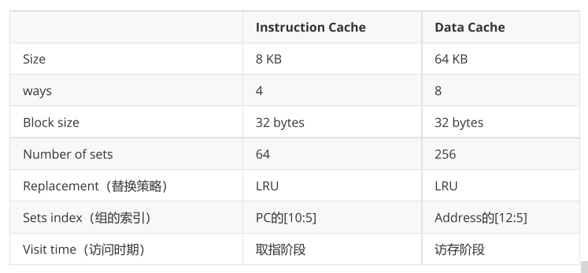

# MIPS pipeline timing simulator
## 实验介绍
 在本实验中，我们将扩展时序模拟器（用C语言编写）以对指令/数据cache进行仿真。模拟器模拟一个简单的MIPS处理器，主要包括两个部分：CPU和内存。计算机要执行的程序（包括代码和数据）都存储在内存中，CPU会将指令从内存中取出，进行解码并且执行代码所表示的操作（包括算术运算、逻辑运算以及存储器控制操作）。要求在原有模拟器的基础上拓展cache部分。 Demo中认为所有的指令和数据都在cache中，访问没有延时，嵌入cache后，访问主存需要50个cycle。
## 文件结构
 ```c++
 Makefile
 run         : python运行脚本
 basesim     : 标程对比答案使用
 basesim.exe : 标程对比答案使用，兼容windows
 inputs      : 测试文件
 src         : 可以自行添加其他文件，如cache.c,cache.h
   -pipe.c
   -pipe.h
   -shell.c
   -shell.h
   -mips.h    : MIPS相关的定义
 ```
 ## Cache具体要求
 
 
 具体请参考实验指导书lab3.pdf
 
